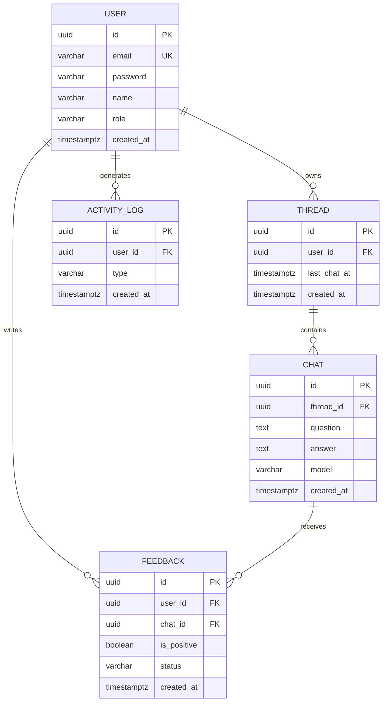

# AI Chat API

OpenAI를 직접 호출하는 대신, 인증과 대화 기록, 피드백, 통계 기능을 갖춘 REST API 서버로 감싼 챗봇 백엔드입니다. 클라이언트는 OpenAI API 스펙을 몰라도 이 서버의 API만으로 챗봇을 쓸 수 있습니다. LLM 공급자를 바꾸거나 사내 문서 기반 RAG로 확장하더라도 외부 API는 그대로 유지되도록 구조를 잡았습니다.

- Kotlin 1.9 / Spring Boot 3.5 / Java 21
- H2 (in-memory): clone 후 바로 실행
- Spring Security + JWT 인증
- Spring MVC + SSE 스트리밍
- LLM 공급자 추상화: `OpenAiProvider`(실연동), `MockProvider`(키 없이 데모)

## 빠른 시작

```bash
./gradlew bootRun
```

Gradle을 따로 설치하지 않아도 됩니다. 동봉된 wrapper(`./gradlew`)가 받아옵니다. JDK는 17 이상이면 되고 21을 권장합니다.

서버는 `http://localhost:8080`에서 뜹니다. API 키가 없어도 Mock 공급자로 모든 기능이 동작합니다.

기동 후 `http://localhost:8080/swagger-ui.html`에서 전체 엔드포인트를 확인하고 바로 호출해 볼 수 있습니다. 로그인으로 받은 JWT를 우측 상단 Authorize에 넣으면 보호된 API도 호출됩니다.

### 데모 계정 (자동 시드)

| 역할 | 이메일 | 패스워드 |
|------|--------|----------|
| ADMIN | `admin@demo.com` | `admin1234` |
| MEMBER | `member@demo.com` | `member1234` |

H2 in-memory라 재시작할 때마다 같은 계정이 다시 만들어집니다. `app.seed.enabled=false`로 끌 수 있습니다.

### OpenAI 실연동

```bash
OPENAI_API_KEY=sk-... ./gradlew bootRun
```

키가 설정되면 `OpenAiProvider`가 활성화되어 실제 `gpt-4o-mini`로 응답합니다. 키가 없으면 `MockProvider`로 폴백하며, 코드는 바꿀 필요가 없습니다.

## 1분 시연 (curl)

```bash
# 1) 로그인해서 토큰 받기
TOKEN=$(curl -s localhost:8080/api/auth/login -X POST -H 'Content-Type: application/json' \
  -d '{"email":"member@demo.com","password":"member1234"}' | jq -r .accessToken)

# 2) 대화 생성 (동기)
curl -s localhost:8080/api/chats -X POST -H "Authorization: Bearer $TOKEN" \
  -H 'Content-Type: application/json' -d '{"question":"안녕하세요"}'

# 3) 대화 생성 (스트리밍, SSE)
curl -N localhost:8080/api/chats -X POST -H "Authorization: Bearer $TOKEN" \
  -H 'Content-Type: application/json' -d '{"question":"스트리밍 테스트","isStreaming":true}'

# 4) 대화 목록 (스레드 단위 그룹화)
curl -s "localhost:8080/api/chats?sort=asc" -H "Authorization: Bearer $TOKEN"
```

## 아키텍처

도메인별로 패키지를 나눠서, 기능을 추가하거나 바꿀 때 영향 범위가 한 패키지에 머물도록 했습니다.

```
com.example.aichat
├── common
│   ├── config      # Security, AppProperties, 시드 데이터
│   ├── security    # JWT 발급/검증 필터, UserPrincipal
│   └── exception   # ApiException, 전역 핸들러
├── domain
│   ├── auth        # 회원가입, 로그인
│   ├── user        # User 엔티티, Role
│   ├── chat        # 스레드 세션, 대화, 스트리밍
│   ├── feedback    # 피드백
│   └── analytics   # 활동 집계, CSV 보고서, 활동 로그
└── infra
    └── llm         # LlmProvider 추상화 (OpenAI / Mock)
```

### LLM 공급자 추상화

```
ChatService ──> LlmProvider (interface)
                   ├── OpenAiProvider   (OPENAI_API_KEY 있을 때)
                   ├── MockProvider     (없을 때 폴백)
                   └── (향후) RagProvider / AnthropicProvider ...
```

`LlmProvider`는 `chat()`(동기)과 `streamChat()`(스트리밍) 두 메서드만 노출합니다. 공급자를 바꾸거나 사내 문서를 검색해 컨텍스트로 넣는 RAG를 추가해도 `ChatService`와 외부 API는 바뀌지 않습니다. 어떤 구현을 쓸지는 `LlmConfig`가 키 유무로 정합니다.

### ERD



## API 명세

`/api/auth/**`를 제외한 모든 요청은 `Authorization: Bearer <JWT>` 헤더가 필요합니다.

| 메서드 | 경로 | 권한 | 설명 |
|--------|------|------|------|
| POST | `/api/auth/signup` | 공개 | 회원가입 (항상 MEMBER) |
| POST | `/api/auth/login` | 공개 | 로그인, JWT 발급 |
| POST | `/api/chats` | 인증 | 대화 생성 (`question`, `isStreaming`, `model`) |
| GET | `/api/chats` | 인증 | 대화 목록(스레드 그룹화) `page`,`size`,`sort=asc\|desc` |
| DELETE | `/api/chats/threads/{threadId}` | 인증(소유자) | 스레드 삭제 |
| POST | `/api/feedbacks` | 인증 | 피드백 생성 (`chatId`, `positive`) |
| GET | `/api/feedbacks` | 인증 | 피드백 목록 `positive`,`page`,`size`,`sort` |
| PATCH | `/api/feedbacks/{id}/status` | ADMIN | 피드백 상태 변경 (`status`) |
| GET | `/api/admin/analytics/activity` | ADMIN | 최근 24시간 가입/로그인/대화 수 |
| GET | `/api/admin/analytics/report` | ADMIN | 최근 24시간 전체 대화 CSV |

### 권한 규칙
- 대화/피드백 조회: 멤버는 본인 것만, 관리자는 전체.
- 스레드 삭제: 본인이 생성한 스레드만.
- 피드백 생성: 멤버는 자신의 대화에만, 관리자는 모든 대화에. 대화당 사용자별 하나(복합 유니크).
- 분석, 상태 변경: 관리자만.

### 스트리밍 응답 (SSE)
`isStreaming=true`면 `text/event-stream`으로 응답합니다.
- `event: delta`: 부분 토큰 (여러 번)
- `event: done`: 저장된 대화 전체 (JSON, 한 번)

## 스레드 세션 규칙

OpenAI에 보낼 "지난 대화 묶음"의 단위가 스레드입니다.
- 유저의 첫 질문이거나 마지막 질문 후 30분이 지났으면 새 스레드를 만듭니다.
- 30분 이내에 다시 질문하면 기존 스레드를 유지하고, 이전 대화를 컨텍스트로 함께 보냅니다.

`ChatThread.last_chat_at` 컬럼을 두어 질문할 때마다 30분 경계를 컬럼 비교 한 번으로 판정합니다.

## 테스트

```bash
./gradlew test
```

가장 까다로운 30분 세션 경계(이내, 정확히 30분, 초과)를 `ChatSessionTest`에서 검증합니다. `prepareThread(userId, now)`가 시각을 파라미터로 받게 해서 실제 시간에 의존하지 않고 테스트할 수 있습니다.

## 주요 설계 결정

| 결정 | 이유 |
|------|------|
| LlmProvider 인터페이스 + Mock 폴백 | 키 없이 데모 가능, 공급자나 RAG로 확장해도 상위 계약이 그대로 |
| ID를 UUID(string) | 명세의 ID(string) 표기에 맞추고 분산 환경에 유리 |
| `ActivityLog` 별도 테이블 | 로그인은 다른 테이블에 남지 않아서, 24시간 집계를 한 쿼리로 처리 |
| `ChatStore` 트랜잭션 빈 분리 | 스트리밍 콜백(다른 스레드)의 self-invocation으로 `@Transactional`이 무효화되는 것 방지 |
| `last_chat_at` 비정규화 | 세션 판정을 매번 `max()`로 조회하지 않고 컬럼 하나로 |
| 가입은 항상 MEMBER 고정 | 권한 상승 방지. ADMIN은 시드나 운영 경로로만 |
| 스레드 삭제 시 피드백 정리를 이벤트로 | chat과 feedback 패키지 순환 없이 고아 피드백 제거 |
| Swagger(OpenAPI) 제공 | 스펙을 모르는 고객사에 문서 형태로 전달 |

과제 분석, AI 활용, 가장 어려웠던 기능은 [`DEVELOPMENT_NOTES.md`](./DEVELOPMENT_NOTES.md)에 정리했습니다.
