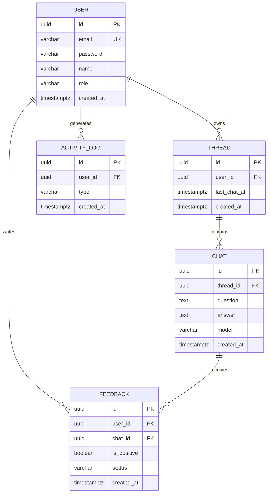

# AI Chat API

OpenAI 같은 LLM 공급자를 **인증·대화기록·피드백·분석이 붙은 자체 백엔드 API로 감싸** 제공하는 챗봇 서버입니다.
클라이언트는 OpenAI spec 을 몰라도 우리의 단순한 REST API 만으로 AI 를 활용할 수 있고,
향후 LLM 공급자 교체나 사내 문서 기반 RAG 확장이 상위 API 계약을 깨지 않도록 설계했습니다.

- **Kotlin 1.9 / Spring Boot 3.5 / Java 21**
- **H2 (in-memory)** — clone 후 즉시 실행 가능
- **Spring Security + JWT** 인증
- **Spring MVC + SSE** 스트리밍
- LLM 공급자 추상화: `OpenAiProvider`(실연동) + `MockProvider`(키 없이 데모)

---

## 빠른 시작

```bash
./gradlew bootRun
```

> Gradle 미설치여도 됩니다. 동봉된 wrapper(`./gradlew`)가 알아서 받습니다. JDK 17+ 필요(21 권장).

서버는 `http://localhost:8080` 에서 뜹니다. **API 키가 없어도** Mock 공급자로 전 기능이 동작합니다.

> **API 문서(메뉴얼)**: 기동 후 **`http://localhost:8080/swagger-ui.html`** 에서 전 엔드포인트를 탐색·시연할 수 있습니다.
> 로그인으로 받은 JWT 를 우측 상단 **Authorize** 에 넣으면 보호된 API 도 바로 호출됩니다.

### 데모 계정 (자동 시드)

| 역할 | 이메일 | 패스워드 |
|------|--------|----------|
| ADMIN | `admin@demo.com` | `admin1234` |
| MEMBER | `member@demo.com` | `member1234` |

H2 in-memory 라 재시작마다 동일 계정이 보장됩니다. (`app.seed.enabled=false` 로 끌 수 있음)

### OpenAI 실연동

```bash
OPENAI_API_KEY=sk-... ./gradlew bootRun
```

키가 설정되면 자동으로 `OpenAiProvider` 가 활성화되어 실제 `gpt-4o-mini` 로 응답합니다.
키가 없으면 `MockProvider` 로 자동 폴백합니다. (코드 변경 불필요)

---

## 1분 시연 (curl)

```bash
# 1) 로그인 → 토큰 획득
TOKEN=$(curl -s localhost:8080/api/auth/login -X POST -H 'Content-Type: application/json' \
  -d '{"email":"member@demo.com","password":"member1234"}' | jq -r .accessToken)

# 2) 대화 생성 (동기)
curl -s localhost:8080/api/chats -X POST -H "Authorization: Bearer $TOKEN" \
  -H 'Content-Type: application/json' -d '{"question":"안녕하세요"}'

# 3) 대화 생성 (스트리밍, SSE)
curl -N localhost:8080/api/chats -X POST -H "Authorization: Bearer $TOKEN" \
  -H 'Content-Type: application/json' -d '{"question":"스트리밍 테스트","isStreaming":true}'

# 4) 대화 목록 (스레드 그룹화)
curl -s "localhost:8080/api/chats?sort=asc" -H "Authorization: Bearer $TOKEN"
```

---

## 아키텍처

도메인별 수직 분리(package-by-feature)로 확장 시 영향 범위를 한 패키지로 가둡니다.

```
com.example.aichat
├── common
│   ├── config      # Security, AppProperties, 시드 데이터
│   ├── security    # JWT 발급/검증 필터, UserPrincipal
│   └── exception   # ApiException, 전역 핸들러
├── domain
│   ├── auth        # 회원가입 / 로그인
│   ├── user        # User 엔티티, Role
│   ├── chat        # 스레드 세션, 대화, 스트리밍   ← 핵심
│   ├── feedback    # 피드백 CRUD
│   └── analytics   # 활동 집계, CSV 보고서, 활동 로그
└── infra
    └── llm         # LlmProvider 추상화 (OpenAI / Mock)
```

### LLM 공급자 추상화 — 이 프로젝트의 확장 지점

```
ChatService ──> LlmProvider (interface)
                   ├── OpenAiProvider   (OPENAI_API_KEY 있을 때)
                   ├── MockProvider     (없을 때 자동 폴백)
                   └── (향후) RagProvider / AnthropicProvider ...
```

`LlmProvider` 는 `chat()`(동기)과 `streamChat()`(스트리밍) 두 메서드만 노출합니다.
공급자 교체나 "사내 대외비 문서 검색 후 컨텍스트 주입(RAG)" 추가 시에도
`ChatService` 와 외부 REST 계약은 그대로 유지됩니다. 활성 구현은 `LlmConfig` 가 키 유무로 결정합니다.

### ERD



---

## API 명세

> `/api/auth/**` 외 모든 요청은 `Authorization: Bearer <JWT>` 헤더가 필요합니다.

| 메서드 | 경로 | 권한 | 설명 |
|--------|------|------|------|
| POST | `/api/auth/signup` | 공개 | 회원가입 (항상 MEMBER) |
| POST | `/api/auth/login` | 공개 | 로그인 → JWT 발급 |
| POST | `/api/chats` | 인증 | 대화 생성 (`question`, `isStreaming`, `model`) |
| GET | `/api/chats` | 인증 | 대화 목록(스레드 그룹화) `page`,`size`,`sort=asc\|desc` |
| DELETE | `/api/chats/threads/{threadId}` | 인증(소유자) | 스레드 삭제 |
| POST | `/api/feedbacks` | 인증 | 피드백 생성 (`chatId`, `positive`) |
| GET | `/api/feedbacks` | 인증 | 피드백 목록 `positive`,`page`,`size`,`sort` |
| PATCH | `/api/feedbacks/{id}/status` | ADMIN | 피드백 상태 변경 (`status`) |
| GET | `/api/admin/analytics/activity` | ADMIN | 최근 24h 가입/로그인/대화 수 |
| GET | `/api/admin/analytics/report` | ADMIN | 최근 24h 전체 대화 CSV |

### 권한 규칙
- **대화/피드백 조회**: 멤버는 본인 것만, 관리자는 전체.
- **스레드 삭제**: 본인이 생성한 스레드만.
- **피드백 생성**: 멤버는 자신의 대화에만, 관리자는 모든 대화에. 대화당 사용자별 1개(복합 유니크).
- **분석/상태변경**: 관리자 전용.

### 스트리밍 응답 (SSE)
`isStreaming=true` 면 `text/event-stream` 으로 응답합니다.
- `event: delta` — 부분 토큰(여러 번)
- `event: done` — 영속화된 대화 전체(JSON, 1번)

---

## 스레드 세션 규칙

OpenAI 에 보낼 "지난 대화 묶음" 단위가 스레드입니다.
- 유저의 **첫 질문**이거나 **마지막 질문 후 30분 초과** → 새 스레드 생성
- **30분 이내** 재질문 → 기존 스레드 유지(이전 대화를 컨텍스트로 동봉)

`ChatThread.last_chat_at` 컬럼으로 매 질문 시 30분 경계를 O(1) 로 판정합니다.

---

## 테스트

```bash
./gradlew test
```

가장 까다로운 30분 세션 경계(이내/정확히 30분/초과)를 `ChatSessionTest` 에서
결정적으로 검증합니다. `prepareThread(userId, now)` 가 시각을 주입받게 설계해
실제 시간에 의존하지 않습니다.

---

## 주요 설계 결정

| 결정 | 이유 |
|------|------|
| LlmProvider 인터페이스 + Mock 폴백 | 키 없이 데모 가능 + 공급자/RAG 확장 시 상위 계약 불변 |
| ID 를 UUID(string) | 과제 명세의 ID(string) 표기 충족 + 분산 친화 |
| `ActivityLog` 별도 테이블 | login 은 다른 테이블에 안 남음 → 24h 집계를 단일 쿼리로 |
| `ChatStore` 트랜잭션 빈 분리 | 스트리밍 콜백(별도 스레드)의 self-invocation 으로 `@Transactional` 무효화 방지 |
| `last_chat_at` 비정규화 | 세션 판정을 매번 `max()` 조회 대신 컬럼 1개로 |
| 가입은 항상 MEMBER 고정 | 권한 상승 방지. ADMIN 은 시드/운영 경로로만 |
| 스레드 삭제 시 피드백 정리를 **이벤트**로 | chat↔feedback 패키지 순환 없이 고아 피드백 제거 |
| Swagger(OpenAPI) 문서 제공 | spec 모르는 고객사에 "메뉴얼"로 전달 (시나리오 대응) |

자세한 과제 분석 / AI 활용 / 가장 어려웠던 기능은 [`DEVELOPMENT_NOTES.md`](./DEVELOPMENT_NOTES.md) 참고.
